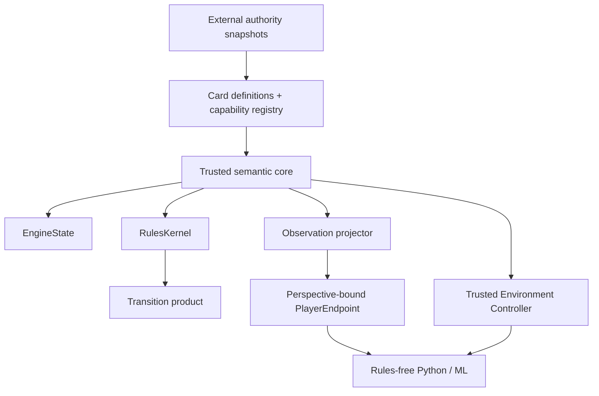

# Manafold

**Deterministic, inspectable, ML-native Magic: The Gathering rules and simulation infrastructure.**

Manafold is a greenfield engine designed for trustworthy rules execution and research. Its core priorities are correctness, determinism, information safety, decision completeness, replayability, and maintainability before raw card count or simulation throughput.

> **Repository status is evidence-driven.** The root [Manafold README on GitHub](https://github.com/chrismaghuhn/Manafold) is the current project-status authority. This GitBook is a curated navigation and presentation layer over the repository's existing contracts; it does not create a second semantic authority.

## Design compass

```text
correctness
→ determinism
→ information safety
→ decision completeness
→ replayability
→ maintainability
→ performance
→ ML scale
```

## System at a glance



The trusted semantic core owns authoritative state, rules execution, deterministic randomness, decisions, events, replay, checkpointing, and conformance. Player-facing endpoints are permanently perspective-bound and expose only authorized observations, retained information state, visible decisions, observed events, and sanitized errors.

## Start here

### Understand the project

- [Vision](VISION.md) — long-term direction and project intent.
- [Scope](SCOPE.md) — what Manafold does and deliberately does not claim.
- [Roadmap](ROADMAP.md) — milestone ordering and bounded M3/M4 progression.
- [Normative Hierarchy](NORMATIVE_HIERARCHY.md) — how contracts, ADRs, schemas, fixtures, and conformance evidence relate.

### Understand the engine

- [Architecture Overview](ARCHITECTURE.md) — trust boundaries and semantic ownership.
- [Domain Model](DOMAIN_MODEL.md) — object identity, zones, authoritative state, and invariants.
- [Execution & Transaction Model](EXECUTION_MODEL.md) — atomic transitions and forced progress.
- [Decision Protocol](DECISION_PROTOCOL.md) — every player-influenced choice is explicit data.
- [Information Model](INFORMATION_MODEL.md) — separation of full state, observation, and retained knowledge.

### Understand determinism and replay

- [Replay & Determinism](REPLAY_AND_DETERMINISM.md)
- [RNG Contract](RNG_CONTRACT.md)
- [State Hashing](STATE_HASHING.md)
- [Compatibility Policy](contracts/COMPATIBILITY_POLICY.md)

### Build Magic semantics

- [Rules Authority Policy](rules/AUTHORITY_POLICY.md)
- [Capability Model](cards/CAPABILITY_MODEL.md)
- [Adding Rules & Mechanics](rules/ADDING_RULES_AND_MECHANICS.md)
- [Adding Cards](cards/ADDING_CARDS.md)
- [Card & Bundle Certification](cards/CERTIFICATION.md)

### Work on the repository

- [Maintainer Playbook](MAINTAINER_PLAYBOOK.md)
- [Maintainer Profiles](maintenance/MAINTAINER_PROFILES.md)
- [Developer Setup](maintenance/DEVELOPER_SETUP.md)
- [Testing & Conformance](TESTING_AND_CONFORMANCE.md)
- [Acceptance Gates](contracts/ACCEPTANCE_GATES.md)

## Core architectural boundaries

| Surface | Owns | Must not expose or own |
| --- | --- | --- |
| Trusted semantic core | rules, state, RNG, decisions, events, exact deltas | model policy, UI, experiment logic |
| Trusted environment controller | reset, checkpoint, restore, fork, replay, scheduling | player-visible privileged state |
| Player endpoint | observation, information state, visible decision, submit | full state, seeds, internal IDs, trusted diagnostics |
| Rules-free Python / ML | models, training, rewards, datasets, orchestration | legality or a second rules implementation |

## Support means evidence

Manafold does not equate importing, parsing, compiling, or implementing with support.

```text
Imported → Parsed → Implemented → Covered → Certified
```

A real support claim belongs to an immutable certified bundle with exact capability closure, source identities, conformance evidence, information-safety evidence, replay/checkpoint parity, and explicit exclusions.

## Documentation authority

The machine-readable [documentation register](normative-document-register.v1.json) classifies normative, process, and informative documents. The [Normative Hierarchy](NORMATIVE_HIERARCHY.md) defines the conflict policy.

If two artifacts describing the same contract disagree, that contradiction is a defect. No GitBook page, schema, fixture, implementation, or prose summary silently wins.

## Historical foundation reference

These documents remain part of the repository's traceable foundation history and are intentionally kept outside the primary reading path:

- [M0.2 Specification](M0_2_SPECIFICATION.md)
- [V0.2.1 Contract Closure](V0_2_1_CONTRACT_CLOSURE.md)
- [V0.2.2 Executable Freeze & Maintainer Ergonomics](V0_2_2_EXECUTABLE_FREEZE_AND_MAINTAINER_ERGONOMICS.md)
- [Freeze Levels](maintenance/FREEZE_LEVELS.md)
