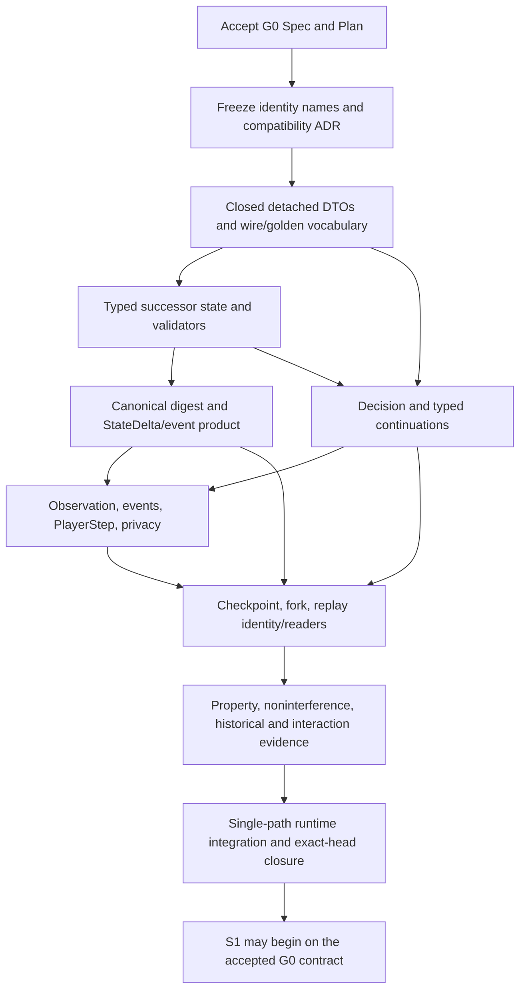

# M4 Shared G0 — Contract-Growth Implementation Plan

**Task:** `M4_SHARED_G0_CONTRACT_GROWTH_SPEC_AND_IMPLEMENTATION_PLAN`
**Status:** G0B, all bounded payload/stage amendments ACCEPTED at Exact-Head, CostRoute V4 descriptor reconciliation ACCEPTED, and SBA graveyard-order Decision preservation ACCEPTED at independent Exact-Head PASS `d6ba1c00a955792bbf96c1067f5fca3b08ccb650`; cast/activation stack-creation and once-per-turn history receipt amendment independently reviewed PASS at `1da3e963f07bdf79ba397bbe99f2e087202fd5ba` (integration branch, pending G0 activation); the forgeable `ProfileDecisionDomainContextV1` amendment was rejected at exact-head review `5ddd7d5a54afe670366db60d9bb0711c88c35aff`; revised fail-closed G0 admission boundary independently reviewed PASS at `e012913d7f2fa55823bcc4c95f46a0460517f21b`; latest accepted Spec amendment Exact-Head `e012913d7f2fa55823bcc4c95f46a0460517f21b`; M4.2 preservation clarification ACCEPTED FOR G0j by PR #252 at reviewed head `aa4a93e5c9da54c7391f9d405ad2a3970dd653db`, merged into the integration lineage at `4d3b82d9517f08fef4b6a2126cb8409049e714ca`; detached implementation baseline remains `f5c1ed2aa0719edaebd95f80f7c1c5c38b3dea3d`; current-writer activation remains gated on G0j evidence
**Derived from:** [`2026-09-27-m4-shared-g0-contract-growth.md`](../specs/2026-09-27-m4-shared-g0-contract-growth.md)
**Exact design baseline:** `85f967f641528e43772c63be14679af398dcac86`
**Implementation authorized:** YES — detached G0c–G0i work only; G0j is the single activation cut

## 1. Baseline and branch/worktree model

The G0a design baseline is post-PR #249 `origin/master` at the SHA above. PR #250 subsequently merged the reviewed G0a Spec/Plan head tree-identically as `8642db7a389d5363d52224bd040082811f626084`. G0a was accepted for G0b only. ADR 0056 then passed independent exact-head review at `72287961907164db6dc7a53b532c8d5076d3516a`, required PR #251 CI, merge at `f5c1ed2aa0719edaebd95f80f7c1c5c38b3dea3d`, and post-merge tree-identity verification. G0b is accepted and this exact SHA is the frozen implementation base. The Shared semantic boundary is accepted for planning. M4.2 remains complete only for the bounded Mountain/Plains slice; the three M4.2 roots remain `specified`; no M4.3/M4.4 production work is in this plan.

After G0 Spec/Plan review and the required version-identity ADR, fetch and freeze a fresh exact master SHA. Create one dedicated G0 integration branch/worktree from that base. All contract-owner PRs described below target that same non-current integration branch in dependency order. Keep master on its existing one-writer runtime until the single final G0 activation PR. Do not create parallel `EngineState`, digest, checkpoint, replay, decision, or event writers. Do not work from the R1-exclusive proposal branch.

The final G0 PR is the one atomic writer boundary. Before that PR, detached successor values/readers/fixtures may be reviewed on the integration branch, but no incomplete successor is current or gameplay-executable. After activation, preserve old readers/verifiers exactly and keep only one executable RulesKernel/environment path. No integration branch or PR is created by this design task.

## 2. Dependency DAG and ordered batches

`G0c` freezes the complete set of contract names/versions before any producer. `G0d` creates the typed state authority with empty runtime semantics. `G0e`, `G0f`, and `G0g` are ordered contract-owner cuts on one branch, not parallel independently versioned runtime writers. Checkpoint/replay cannot close until the final state/digest, decision, and player products have exact identities.

| Batch | Owner / entry | Likely files and work | State / wire / compatibility result | RED and acceptance evidence | S1–S7 unlocked |
|---|---|---|---|---|---|
| **G0a — Spec/Plan acceptance** | Completed by PR #250 | Reviewed G0 documents against source and accepted Shared foundation; no semantic identity assigned | G0a accepted for G0b only. No G0b identity is accepted until its ADR is independently reviewed and merged. | Exact-head review PASS; PR #250 required CI PASS; merge/tree-identity/post-merge PASS. | None; establishes authority to decide G0b. |
| **G0b — Version identity / compatibility ADR** | G0a PASS | Architecture/persistence/decision owners; likely `docs/adr/` plus compatibility/API records | Assign exact successor names only after the compatibility matrix is accepted: state aggregate/zone/execution/continuation, digest, delta/event, checkpoint, replay, request/candidate ordering, observed event, PlayerStep and observation codec. Freeze historical readers/dispositions and no-migration rules. | RED fixture inventory and wire/state identity matrix are approved before producers. | All batches remain blocked until identity decision is frozen. |
| **G0c — Detached successor vocabulary and canonical fixtures** | G0b PASS + independent acceptance of all bounded Spec amendments | `contracts/catalog/`, model/state/decision/observation DTO owners, `schemas/`, `wire/golden/`, `persistence/golden/`, Python DTO modules | Add the exact `ContinuationRecordV3` wrapper and closed V3 union: synthetic assembly, existing Magic SBA order, cast, non-mana activation, trigger placement, and stack resolution. Wrapper owns ID/revision only; action actor and stage are owned/derived by payload, and child values do not repeat continuation IDs. Existing V2 remains historical. Add closed typed successor values and generated vocabulary/schema projections. `PublicStackItemV1::ActivatedAbility` carries `modes[]` under the already assigned shared-execution observation codec; Rust/Python DTOs, schemas, and fixtures agree that activated modes are present and slot-ordered. | Rust/Python round-trip; exact bytes; wrapper/payload/actor/stage coherence for every tag; cast/non-mana/trigger-placement/paused-resolution, including parent/inner payment-stage consistency; preserve synthetic and Magic SBA semantic cases; malformed/overflow/duplicate/noncanonical negatives; old V6/V7/V3 fixtures unchanged. The positive Decision V4 fixture covers `SbaGraveyardOrder` (`Order` domain with `SelectObject` candidates), every one of the eleven rank-ordered trigger event/subject pairs, and all three safe target descriptor variants, including stack-position projection; negative fixtures reject purpose/candidate mismatch, tag/subject mismatch, and trusted trigger/stack identity. | Defines target shapes used by S1–S7; still no runtime use. |
| **G0d — Successor state, continuations, and local validators** | G0c PASS | `crates/mtgml-state/src/`, `crates/mtgml-model/src/`; successor aggregate/value records | Add one typed successor aggregate containing stack payloads in the ZoneState owner, typed trigger records/placement order, temporary-effect records, staged-action and paused-resolution continuations, and selected cost operands. Reuse ID allocators; no extra stack/effect/trigger/action allocator. Validate ID bijections, source refs/LKI, content joins, all closed trigger-event variants, target-timing tag consistency, target/mode order, duration, canonical maps, continuation stages, and one shared ManaPaymentStaging embedded in cast, non-mana activation, and paused-stack-resolution continuations; typed action_cost_facts/selected cost operands; ability-source reservations; and optional staging only when the determined mana cost is nonzero. Values remain detached from live rules producers. | RED constructors/validation for empty/nonempty payloads, every trigger-event fact including beginning-of-combat and Lore-counter occurrence, paused resolving-item identity/stage, optional pay/decline and resume, selected cost operands, departure/LKI, stale incarnations, duplicate order IDs, unknown profile tags, expiry, allocator exhaustion, and state substitution. | Establishes the records S1–S6b will consume; does not implement their capabilities. |
| **G0e — State identity, StateDelta, authoritative events** | G0d PASS | `crates/mtgml-state/src/persisted_*`, `digest_*`, `delta_*`; `crates/mtgml-rules/src/events*`, semantic cursor/validator | Add the restricted-CBOR V7 input/domain and KATs, successor full-replacement Delta/operations, typed authoritative events, and sequential event cursor. Preserve V6/V7/V3 predecessor bytes and validators. No Serde hashing or independent event log. State-only admission rejects unsupported or unadmitted profile-dependent V4 requests; the reviewed G0j M4.2 path must first obtain exact RulesKernel domain authorization. Raw canonical-byte hashing is not state admission. Cast/activation events pair with exact new stack items, and AbilityActivated carries its profile-derived once-per-turn receipt. | Every G0-admissible authoritative field changes successor digest; insertion-order independence; decoder limits/closed tags; exact StateDelta reapplication; event-to-delta-to-after-state parity; rejected transition identity unchanged. Include fail-closed negatives for unsupported profiles and unadmitted requests at typed state, digest, and Delta APIs. M4.2 request admission and digest/Delta parity are covered by the G0j V7↔V8 matrix. Detached fixtures may check bytes but cannot establish domain admission. | S1–S7 share the sole persistent-state and event/delta owner. |
| **G0f — Decision vocabulary, structural binding, and request projection** | G0c/G0d PASS; G0e operation vocabulary frozen; revised fail-closed G0 boundary independently reviewed PASS at `e012913d7f2fa55823bcc4c95f46a0460517f21b` | `crates/mtgml-decision/`, state continuation validation, decision schemas, Python request/response DTOs/codecs and fixtures | Add successor Decision purposes, parent context, candidate/binding variants for cost operands, optional Ward payment, mana production, and trigger ordering. Validate purpose/domain/continuation-stage relation, exact visible-intent/trusted-binding correspondence, canonical order, actor visibility, and stale/fabricated response rejection. All uncharacterized profile-dependent V4 shapes remain detached; the sole proposed exception is verified M4.2 Basic Land PriorityAction admission at G0j after §9.4 is independently accepted. Generic state-only validators stay fail-closed. No profile-context DTO or public caller-supplied domain proof. Preserve existing Magic SBA graveyard ordering with typed `SbaGraveyardOrder`, complete APNAP owner set, `Order` domain, and safe `SelectObject` candidates. Preserve `CostRouteDescriptorV1` wire shape and actor-only visibility, but do not claim its domain is sound/complete from a detached fixture. | Prove all Decision shape, purpose/domain, continuation stage, candidate binding, identity, ordering, and visibility invariants; preserve SBA and TriggerOrder exact state-derived domains. Unsupported profile-dependent requests reject at all state-only admission boundaries. G0j separately proves the complete V4 Basic Land subset by V7↔V8 request/domain parity. Cast/payment/target/Blight/optional-cost/mana-source domain soundness/completeness and staged response parity remain entry gates for the first Shared Rules batch that emits each family; its RulesKernel derives the request from verified immutable profile facts and state before accepting it. No fake context can be built by copying a pending request. | Defines Decision DTOs for S2–S5; does not admit or implement new profile-dependent choices. |
| **G0g — Safe observations, observed events, PlayerStep** | G0e/G0f PASS | `crates/mtgml-observation/`, `crates/mtgml-environment/`, schemas, Python DTOs/fixtures | Add the successor ObservationEnvelope, PlayerInformationState/InformationStateDigest, ObservedEvent and PlayerStep producers. Remove global StateRevision from all player products and bind only the existing per-perspective view sequence. Project the bounded stack/effect view under the named payload codec; project V4 event occurrences only from Rules-authored audience/lifecycle records; compose PlayerStep V4 from the authoritative next request and safe product stream. The G0 producer remains detached from current runtime aliases until G0j. | Paired admitted G0 worlds differing in hidden library/card identity/order, global revision, allocator/RNG history, and trusted stack/effect IDs but with the same public result must emit byte-equal unauthorized products. The cursor advances only for that perspective’s authorized occurrences. Test no trusted IDs, all public V3 event meaning under V4, activated modes, stack add/remove positions, temporary effects, info-state digest, exact pending request composition, and Rust/Python/schema parity. Profile-dependent staged-world/count noninterference remains an entry gate for the first Shared Rules batch that admits those requests. | Every S1–S7 player-product boundary; prevents global revision and allocator-history leakage. |
| **G0h — Checkpoint, fork, replay, compatibility readers** | G0e–G0g PASS | `crates/mtgml-environment/src/checkpoint*`, `crates/mtgml-replay/src/`, schemas, Python persistence/replay DTOs, persistence/golden fixtures | New checkpoint/digest and replay families bind successor state/digest, Decision request/response, event, PlayerStep and observation codec IDs. Restore validates all admitted state completely before mutation. Profile-independent pending Decisions restore/replay under their state-derived validators. Unsupported or unadmitted profile-dependent V4 requests fail closed. The proposed M4.2 Basic Land route requires exact RulesKernel rederivation before checkpoint/restore/fork/replay admission at G0j. Preserve V6/V7/V3 predecessors as exact detached verifiers/readers; no automatic migration. | Direct vs restored/forked/replayed G0-admitted state, delta, events, request, safe per-perspective view sequence and final identities; tampered histories; rejected restore/replay nonmutation; every old golden unchanged. Cast/payment/activation/paused-Ward staged parity must be proven in the first Shared Rules batch that creates each of those requests, with restore/fork/replay domain rederivation under the same exact immutable identity before its producer is enabled. The full accepted M4.2 parity matrix is a separate G0j pre-activation gate. | Every G0 persistence boundary; unsupported profile-dependent staged-action parity remains an explicit S-batch entry gate. |
| **G0i — Cross-layer RED, properties, noninterference, historical evidence** | G0e–G0h PASS | `crates/mtgml-conformance/`, Rust/Python tests, property/fuzzing and noninterference suites | No new semantics or identity. Close evidence gaps for every new record and product in the detached G0-admissible scope. | Legal-space soundness/completeness for every admitted profile-independent Decision; fail-closed profile-dependent request matrix; arbitrary permitted record construction; property/fuzz bounds; paired-world noninterference; source-departure/lifetime; historical fixture regression. V7↔V8 M4.2 execution parity is a separate mandatory G0j pre-activation gate because G0i does not make a successor runtime current. Other profile-dependent staged-action evidence remains an entry gate for its first Shared Rules producer batch. | G0 acceptance only after the detached contract families close and the G0j preservation gate passes before activation. |
| **G0j — One-path integration and exact-master activation** | G0i PASS; M4.2 preservation clarification independently accepted; exact branch head frozen | Existing Basic Land RulesKernel owner, successor RulesKernel/environment commit path, V4 request/response projection, V8 checkpoint/replay aliases; integration branch then one final master PR | Migrate in place to one V8 writer while preserving exactly the accepted `basic-land@1.0.0` executable actions: pass priority, legal PlayLand, and activation of intrinsic Mountain/Plains mana abilities. Reuse and port the existing Basic Land candidate/domain/transition owner; no new profile or card rule. RulesKernel-owned exact V4 domain admission is the only M4.2 exception to generic profile-dependent fail-closed state validation. All unsupported profiles/actions remain rejected. Preserve predecessor detached readers/verifiers. Do not implement spell casting, general stack resolution, or S1–S7. | Before activating V8 aliases, run paired V7↔V8 M4.2 scenarios comparing complete legal domains/trusted bindings, accepted state transitions, rejection/nonmutation, public observation/event meaning, candidate order, state/event/delta reconstruction, and direct/checkpoint-restore/fork/replay outcomes. Verify `FullStateDigestV6` and `FullStateDigestV7` under their respective domains and CheckpointDigestV7/V8 independently; cross-version digest bytes need not match. Also run unsupported-profile fail-closed, privacy/noninterference, historical compatibility, `just check-fast`, `just check`, `just check-all`, generated/schema/Python/Rust tests, exact-head hosted CI, independent exact-head review, and post-merge exact-master verification. No V8 writer becomes current until every gate passes. | Unblocks S1 with the already accepted M4.2 slice intact. It does not add cards, capabilities, or broader playability. |

All batches run sequentially on one G0 integration lineage. Splitting PRs by semantic owner is acceptable only when commits still target the same lineage and no partially current writer is exposed. Batch boundaries do not authorize three parallel Codex sessions to implement dependent S1/S2/S3 contracts before G0 closure.

## 3. Contract-growth sequence and file ownership

1. G0b and the trigger/source payload, temporary-operation, StackResolution, Cast/Activation, and continuation-wrapper amendments are accepted. ContinuationRecordV3 owns only ID/revision; actors are payload-owned or derived; the V3 union retains the synthetic assembly and Magic SBA variants. Exact review head: `f0a493c740f9002e5551d317a1411c11067a7bb3`. Origin of Spider-Man's permanent chapter II type addition is W1-exclusive and needs a separate persistent-effect contract characterization before W1 implementation; it does not expand G0. G0c DTO work must match accepted exact source/event shapes, the final accepted temporary operation set, and must not add a generic `resolution_context` map or field.
2. Add detached Rust DTOs, semantic validators, canonical encoding, and golden/negative fixtures; keep current runtime aliases unchanged.
3. Add successor Decision request/binding and response schemas plus Rust/Python codecs from the same source vocabulary. The answer union remains unchanged, while the player response omits global StateRevision and binds PlayerDecisionIdV1/view-sequence. Profile-dependent request vocabulary remains detached and fail-closed until its Rules profile-domain producer is implemented in the corresponding Shared batch.
4. Add state/delta/authoritative-event producers and semantic cursor validation against the detached successor state.
5. Add safe stack/effect observation, observed events, and PlayerStep projection. Python stays rules-free.
6. Add successor checkpoint/fork/replay encoders/readers only after all typed component IDs are final.
7. Prove all cross-layer products and historical-reader matrices before one-path integration.
8. Integrate one successor runtime authority in place on the non-current branch; do not retain an executable old runtime alias on that branch.
9. Open one final activation PR to master after exact-head CI and review; perform post-merge exact-master verification.

Likely production ownership paths during the future G0 implementation (inspection targets, not edits in this task):

* `crates/mtgml-state/`: successor state aggregate, typed records, validators, mutation operations, Delta and canonical V6-successor encoder;
* `crates/mtgml-rules/`: trusted event variants, RulesKernel candidate/commit path, trigger cursor, no separate callback executor;
* `crates/mtgml-model/`: only genuinely new closed identity/wire value types after ADR acceptance;
* `crates/mtgml-decision/`: successor candidate/binding/ordering types and successor player response; DecisionResponseV2 remains historical only. Rules-owned profile-domain admission remains with the first Shared batch that produces a profile-dependent Decision;
* `crates/mtgml-observation/` and `crates/mtgml-environment/`: audience projection, safe stack/effect payload, atomic product validation;
* `crates/mtgml-persistence/`, `crates/mtgml-replay/`: versioned canonical digest/checkpoint/replay owners;
* `contracts/catalog/`: authoritative mechanical vocabulary only; generated files change only by generator;
* `schemas/`, `python/src/mtgml/`, `wire/golden/`, `persistence/golden/`, conformance fixtures: closed parity surfaces and immutable predecessor vectors.

## 4. Test and evidence plan

G0 implementation RED is contract-focused, not card implementation:

* Stack: spell/ability/trigger origin variants; source departure; face/profile binding; modes and target slot order; paid-cost outcome retained; counter/resolve removal; paused stack-resolution continuation preserves the exact resolving item and resumes after Ward pay/decline plus mana staging; unknown payload rejects.
* Triggers: event-time capture; controller and intervening-if receipt; pending state across checkpoint; APNAP actor order; same-player explicit order; trigger source departure; no RuleEventId-only reconstruction.
* Temporary effects: additive P/T, keyword/type/protection bounded tags; duration validation; exact end-of-turn expiry; effect map/order canonicalization; static Aura/Role contribution has no EffectInstanceId record.
* Continuations/Decision: in G0, prove typed continuation-stage coherence, purpose/domain relations, structural candidate/binding equality, exact profile-independent SBA/trigger-order domains, stale/fabricated response rejection, and fail-closed rejection of every unsupported or unadmitted profile-dependent pending request at every generic state-admission boundary. The proposed M4.2 exception is admitted only through its exact RulesKernel-derived domain at G0j and is gated on the full parity matrix. Detached fixtures for R1/W1 cards or choices may establish wire shape only; they do not establish legal-domain completeness or accepted-state admission. Each later Shared Rules batch that produces a profile-dependent Decision must independently generate its full candidate domain from immutable verified profile facts plus current state, then prove payment reservations, Blight operands, target legality, mana-source outputs/allocations, optional costs, atomic commits, and total rejection nonmutation for that semantic family. Preserve the exact M4.2 SBA path and trigger-order descriptor/injectivity requirements in G0.
* Decision wire and structural validation: preserve the exact closed Decision V4 purpose/domain and candidate/binding shapes, visibility rules, canonical ordering, parent identity and existing M4.2 SBA/trigger-order behavior. Profile-dependent cast, mode, target, cost, payment, optional-cost, ability, attacker, and trigger-target requests remain detached vocabulary during G0 and are rejected at authoritative state admission; their exact all-and-only domains must be generated and proved by the first Shared Rules batch that emits them. No context copied from a stored pending request can authorize admission.
* Observation/event RED fixtures: the complete active M4.2 basic-land observation field family under the successor payload ID; do not nest/reinterpret the prior combat payload codecs; closed stack-item variants, ordered modes/targets, nullable source pair rules, resolved/countered removals with pre-removal top position, all three ManaPoolChanged causes, temporary P/T and keyword effects with end-of-turn expiry, exact stack top-to-bottom and temporary-effect view order/multiplicity (P/T signed numeric order, Haste before DoubleStrike, sorted affected objects, turn expiry), opaque IDs only, and base64/digest/cursor consistency. V4 events retain each V3 meaning exactly while omitting global StateRevision.
* Delta/events: one event/operation sequence explains each mutation; complete replacement digest matches; no event-only or state-only mutation; repeated/mixed events validate through sequential cursor.
* Digest: mutate each stack/trigger/effect/continuation/order/allocator fact independently; exact successor KATs; unknown tags/ranges/duplicates/order/canonical failures reject before construction.
* Checkpoint/fork/replay: in G0h, save/restore/fork/re-execute every generically admitted state and profile-independent pending Decision; reject unsupported or unadmitted profile-dependent pending requests. At G0j, the verified M4.2 Basic Land route must prove direct = restore = fork = response replay with exact V4 candidate-domain regeneration, state/digest/status/delta/events/requests/observations, and rejected-operation nonmutation. Each later Shared Rules batch that admits a new profile-dependent stage proves the same parity for its own domain.
* Privacy: G0 paired-state evidence covers hidden library/card identity and order, global revision, allocator/RNG history, and trusted stack/effect ID renaming while public results agree; unauthorized player-product bytes remain equal and public facts use opaque identities. Profile-dependent target/cost/source/Ward stage-count pairs are required in the first Shared Rules batch that admits those staged requests, not inferred from detached wire fixtures.
* Wire: positive/negative Rust↔Python fixtures; unknown fields/variants and wrong schema fail closed; Python never constructs legal domains or executes a rule profile.

All historical V6/V7/V3 goldens and any predecessor fixtures stay byte-identical. New lifecycle status is not inferred from DTO existence or tests alone; capability implementation/coverage/certification remains later Shared/R1/W1 work.

## 5. PR decomposition and gates

Expected review slices on the single G0 integration lineage:

1. G0 identity/compatibility ADR and frozen canonical data model (design prerequisite).
2. Detached successor state/continuation DTOs, StackResolutionContinuation, typed cost-operand values, and structural RED fixtures.
3. Successor digest/Delta/event cursor and historical digest readers.
4. Decision request-parent context, cost-operand/optional-payment purposes and bindings, mana-source candidate bindings/order, Python/schema parity; no profile-dependent state admission is enabled by this detached contract batch.
5. Observation/ObservedEvent/PlayerStep projection and noninterference.
6. Checkpoint/fork/Replay successor and exact historical reader matrix.
7. Cumulative property/fuzz/conformance and one-path runtime integration.
8. Final master activation PR with full exact-head gates and independent review.

Do not create a contract-growing branch before G0 is accepted. The branch is then a single worktree and single current writer lineage. `just check-fast` is the early loop; `just check` and `just check-all` apply to the coupled state/privacy/replay cut. Run generated contract/catalog `--check`, schema validation, Rust format/clippy/tests, documented Python suite, golden/negative parity, property/fuzzing and paired-world noninterference. Exact-head hosted Fast, Integration, Windows smoke and CodeQL/GitBook jobs follow repository policy. `just release-candidate` is only required if the accepted G0 slice is explicitly presented as a release candidate; archive verification runs after the last source change if required by the accepted release/activation gate.

The design task itself runs only documentation/register checks and `git diff --check`; those are not substitutes for future G0 implementation gates. Every future report distinguishes `PASS`, `FAIL`, `NOT_RUN`, and `BLOCKED` and names the exact source head.

## 6. Stop conditions

Stop before the affected batch if:

* `origin/master` has changed from the frozen exact implementation base;
* a persisted identity would reinterpret V6/V7/V3 bytes or schema values;
* a payload can be reconstructed only from source that may leave or an unlogged event;
* one fact has two authoritative owners (including `ZoneState` vs an action sidecar);
* stack/trigger/trigger-order candidate descriptors require a trusted ID or hidden tiebreak;
* the successor Decision request/binding contract cannot express all-and-only characterized payment/target/order choices with closed values;
* staged costs could mutate before a rejected cast/activation;
* a public observation/event reveals internal IDs or unauthorized trigger/card facts;
* fork/restore/replay/digest parity fails;
* implementation needs arbitrary payloads, callbacks, free-form text dispatch, or a universal rules interpreter.

For any semantic discovery: STOP → amend the G0 Spec → independent re-review → regenerate this Plan. Do not preserve numeric names already introduced by a failed design by changing their meaning.

## 7. Must remain unchanged in this design task

No production Rust/Python runtime, schema/wire source, golden, CardDefinition, capability registry/lifecycle, deck list, rules implementation, or implementation branch changes. Only the G0 Spec/Plan, their normative document-register entries, and the two Shared document acceptance-status lines are allowed. No Shared G0 implementation, S1–S7 implementation, M4.3/M4.4 implementation, support claim, or certification starts.
