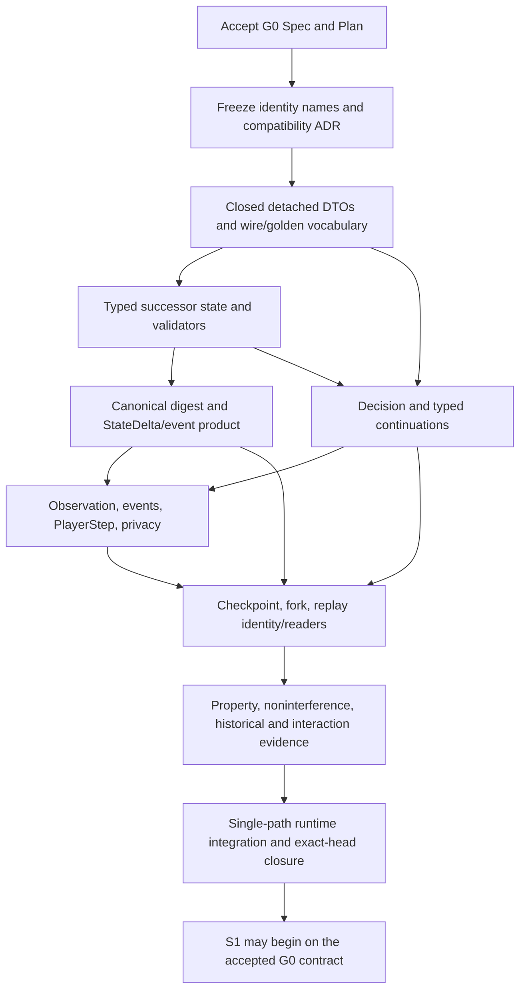

# M4 Shared G0 — Contract-Growth Implementation Plan

**Task:** `M4_SHARED_G0_CONTRACT_GROWTH_SPEC_AND_IMPLEMENTATION_PLAN`
**Status:** PROPOSED / NOT ACCEPTED / NO IMPLEMENTATION AUTHORITY
**Derived from:** [`2026-09-27-m4-shared-g0-contract-growth.md`](../specs/2026-09-27-m4-shared-g0-contract-growth.md)
**Exact design baseline:** `85f967f641528e43772c63be14679af398dcac86`
**Implementation authorized:** NO

## 1. Baseline and branch/worktree model

The verified design baseline is post-PR #249 `origin/master` at the SHA above. The Shared semantic boundary is accepted for planning, while its Spec/Plan remain no-implementation-authority until the G0 boundary is accepted. M4.2 remains complete only for the bounded Mountain/Plains slice; the three M4.2 roots remain `specified`; no M4.3/M4.4 production work is in this plan.

After G0 Spec/Plan review and the required version-identity ADR, fetch and freeze a fresh exact master SHA. Create one dedicated G0 integration branch/worktree from that base. All contract-owner PRs described below target that same non-current integration branch in dependency order. Keep master on its existing one-writer runtime until the single final G0 activation PR. Do not create parallel `EngineState`, digest, checkpoint, replay, decision, or event writers. Do not work from the R1-exclusive proposal branch.

The final G0 PR is the one atomic writer boundary. Before that PR, detached successor values/readers/fixtures may be reviewed on the integration branch, but no incomplete successor is current or gameplay-executable. After activation, preserve old readers/verifiers exactly and keep only one executable RulesKernel/environment path. No integration branch or PR is created by this design task.

## 2. Dependency DAG and ordered batches

`G0c` freezes the complete set of contract names/versions before any producer. `G0d` creates the typed state authority with empty runtime semantics. `G0e`, `G0f`, and `G0g` are ordered contract-owner cuts on one branch, not parallel independently versioned runtime writers. Checkpoint/replay cannot close until the final state/digest, decision, and player products have exact identities.

| Batch | Owner / entry | Likely files and work | State / wire / compatibility result | RED and acceptance evidence | S1–S7 unlocked |
|---|---|---|---|---|---|
| **G0a — Spec/Plan acceptance** | This design; exact master re-fetch | Review G0 documents against source and accepted Shared foundation; resolve semantic questions; no source edits | No contract identity chosen. Record baseline drift and any source/docs conflict before proceeding. | Independent exact-head review; no unresolved BLOCKER/MAJOR; status sync and doc register verified. | None; only establishes authority to decide G0. |
| **G0b — Version identity / compatibility ADR** | G0a PASS | Architecture/persistence/decision owners; likely `docs/adr/` plus compatibility/API records | Assign exact successor names only after the compatibility matrix is accepted: state aggregate/zone/execution/continuation, digest, delta/event, checkpoint, replay, request/candidate ordering, observed event, PlayerStep and observation codec. Freeze historical readers/dispositions and no-migration rules. | RED fixture inventory and wire/state identity matrix are approved before producers. | All batches remain blocked until identity decision is frozen. |
| **G0c — Detached successor vocabulary and canonical fixtures** | G0b PASS | `contracts/catalog/`, model/state/decision/observation DTO owners, `schemas/`, `wire/golden/`, `persistence/golden/`, Python DTO modules | Add closed typed shapes and generated vocabulary/schema projections for successor records; positive and negative vectors; unknown tags/fields reject. Keep generated source authoritative. No production candidate generator or rules behavior. | Rust/Python round-trip; exact bytes; candidate ordering vectors; malformed/overflow/duplicate/noncanonical negatives; old V6/V7/V3 fixtures unchanged. | Defines target shapes used by S1–S7; still no runtime use. |
| **G0d — Successor state, continuations, and local validators** | G0c PASS | `crates/mtgml-state/src/`, `crates/mtgml-model/src/`; successor aggregate/value records | Add one typed successor aggregate containing stack payloads in the ZoneState owner, typed trigger records/placement order, temporary-effect records, staged-action and paused-resolution continuations, and selected cost operands. Reuse ID allocators; no extra stack/effect/trigger/action allocator. Validate ID bijections, source refs/LKI, content joins, target/mode order, duration, canonical maps, continuation stages, and one shared ManaPaymentStaging embedded in cast, non-mana activation, and paused-stack-resolution continuations; typed action_cost_facts/selected cost operands; ability-source reservations; and optional staging only when the determined mana cost is nonzero. Values remain detached from live rules producers. | RED constructors/validation for empty/nonempty payloads, paused resolving-item identity/stage, optional pay/decline and resume, selected cost operands, departure/LKI, stale incarnations, duplicate order IDs, unknown profile tags, expiry, allocator exhaustion, and state substitution. | Establishes the records S1–S6b will consume; does not implement their capabilities. |
| **G0e — State identity, StateDelta, authoritative events** | G0d PASS | `crates/mtgml-state/src/persisted_*`, `digest_*`, `delta_*`; `crates/mtgml-rules/src/events*`, semantic cursor/validator | Add the new restricted-CBOR input/domain and KATs, successor full replacement Delta/operations, typed authoritative events and sequential event cursor. Preserve existing V6/V7/V3 bytes and validators. No Serde hashing or independent event log. | Every authoritative field changes successor digest; insertion-order independence; decoder limits/closed tags; exact StateDelta reapplication; event-to-delta-to-after-state parity; rejected transition identity unchanged. | S1–S7 share the sole persistent-state and event/delta owner. |
| **G0f — Decision, action continuation, and request projection** | G0c/G0d PASS; G0e operation vocabulary frozen | `crates/mtgml-decision/`, state continuation validation, decision schemas, Python request/response DTOs/codecs and fixtures | Add successor DecisionPurpose/parent context, candidate/binding variants for cost-operand selection, optional Ward payment, mana-production choice (source activation or finalization), payment allocation and trigger ordering. C58 combat assignment remains deferred until its legal relation is accepted. Keep DecisionDomainV2/DecisionAnswerV2 meaning, but add a successor response value without global StateRevision. CandidateOrdering successor compares only typed public values. Parent link reuses per-perspective PlayerDecisionIdV1; trusted ContinuationId remains internal. | Soundness/completeness oracle; exact target slot bindings; all-and-only legal next mana-source/finalization candidates and payment allocations; verify source IDs, ability binding, TapSource receipt, restricted-output bucket and ordered provisional pool for casts, mana-costed non-mana activations and paused Ward resolution; verify Blight 2 object choice binding and exact counter operation; prove the ability source reserved for `{T}` is absent from mana-source candidates for Rockface Village and Abandoned Air Temple; prove the resolving Ward item and its target remain unchanged during pay/source/allocation staging; chosen source sequence and derived provisional pool survive restore/fork/replay for cast, non-mana activation, and paused Ward resolution; selected Blight operand and stack-resolution stage also round-trip exactly; trigger descriptors reveal no trusted ID; stale/fabricated/malformed response nonmutation; one action-stage per response. | S2, S3, S4, S5 cost/stack-resolution decision contracts; C58/S7 combat assignment stays deferred. |
| **G0g — Safe observations, observed events, PlayerStep** | G0e/G0f PASS | `crates/mtgml-observation/`, `crates/mtgml-environment/`, schemas, Python DTOs/fixtures | Add successor ObservationEnvelope, PlayerInformationState/InformationStateDigest, ObservedEvent and PlayerStep identities. Remove global StateRevision from all player products; bind only the existing per-perspective view sequence. Add stack/effect projections under a new named payload codec. | Paired worlds with different counts of private stages but same public result must have identical unauthorized observation/info/event/step bytes; the public cursor advances only for that perspective's visible occurrences; no trusted IDs; Rust/Python parity. | Every S1–S7 player-product boundary; prevents staged-action count leakage. |
| **G0h — Checkpoint, fork, replay, compatibility readers** | G0e–G0g PASS | `crates/mtgml-environment/src/checkpoint*`, `crates/mtgml-replay/src/`, schemas, Python persistence/replay DTOs, persistence/golden fixtures | New checkpoint/digest and replay families bind successor state/digest, Decision request/response, event, PlayerStep and observation codec IDs. Replay preserves trusted global revisions internally; player responses and projected products do not. Restore validates completely before mutation. Preserve V6/V7/V3 predecessors as exact detached verifiers/readers; no automatic migration. | Direct vs restored/forked/replayed state, delta, events, request, safe per-perspective view sequence, and final identities; tampered histories; rejected restore/replay nonmutation; every old golden unchanged. | Every S1–S7 persistence/replay obligation. |
| **G0i — Cross-layer RED, properties, noninterference, historical evidence** | G0e–G0h PASS | `crates/mtgml-conformance/`, Rust/Python tests, property/fuzzing and noninterference suites | No new semantics or identity. Close evidence gaps for every new record and product. | Legal-space soundness/completeness; arbitrary permitted record construction; property/fuzz bounds; paired-state tests; source-departure/lifetime; complete replay parity; historical fixture regression. | G0 acceptance only after all contract families close. |
| **G0j — One-path integration and exact-master activation** | G0i PASS; exact branch head frozen | Existing RulesKernel, environment/controller commit path, projection, checkpoint, replay aliases; integration branch then one final master PR | Migrate in place on the integration branch to one successor writer. Preserve predecessor detached readers/verifiers. Do not implement spells/triggers/effects beyond contract construction and no-op/empty witnesses. Activate only the complete reviewed successor on master. | Applicable `just check-fast`, `just check`, `just check-all`, generated/schema/Python/Rust tests, historical compatibility, replay/checkpoint/fork/privacy/property gates, exact-head hosted CI, independent review, post-merge exact-master verification. | Unblocks S1. It does not implement S1 or claim any card/capability support. |

All batches run sequentially on one G0 integration lineage. Splitting PRs by semantic owner is acceptable only when commits still target the same lineage and no partially current writer is exposed. Batch boundaries do not authorize three parallel Codex sessions to implement dependent S1/S2/S3 contracts before G0 closure.

## 3. Contract-growth sequence and file ownership

1. Freeze G0's proposed typed records and exact successor identity names in the required ADR/compatibility decision.
2. Add detached Rust DTOs, semantic validators, canonical encoding, and golden/negative fixtures; keep current runtime aliases unchanged.
3. Add successor Decision request/context/binding and response schemas plus Rust/Python codecs from the same source vocabulary. The answer union remains unchanged, while the player response omits global StateRevision and binds PlayerDecisionIdV1/view-sequence.
4. Add state/delta/authoritative-event producers and semantic cursor validation against the detached successor state.
5. Add safe stack/effect observation, observed events, and PlayerStep projection. Python stays rules-free.
6. Add successor checkpoint/fork/replay encoders/readers only after all typed component IDs are final.
7. Prove all cross-layer products and historical-reader matrices before one-path integration.
8. Integrate one successor runtime authority in place on the non-current branch; do not retain an executable old runtime alias on that branch.
9. Open one final activation PR to master after exact-head CI and review; perform post-merge exact-master verification.

Likely production ownership paths during the future G0 implementation (inspection targets, not edits in this task):

* `crates/mtgml-state/`: successor state aggregate, typed records, validators, mutation operations, Delta and canonical V6-successor encoder;
* `crates/mtgml-rules/`: trusted event variants, RulesKernel candidate/commit path, trigger cursor, no separate callback executor;
* `crates/mtgml-model/`: only genuinely new closed identity/wire value types after ADR acceptance;
* `crates/mtgml-decision/`: successor candidate/context/binding/ordering types and successor player response; DecisionResponseV2 remains historical only;
* `crates/mtgml-observation/` and `crates/mtgml-environment/`: audience projection, safe stack/effect payload, atomic product validation;
* `crates/mtgml-persistence/`, `crates/mtgml-replay/`: versioned canonical digest/checkpoint/replay owners;
* `contracts/catalog/`: authoritative mechanical vocabulary only; generated files change only by generator;
* `schemas/`, `python/src/mtgml/`, `wire/golden/`, `persistence/golden/`, conformance fixtures: closed parity surfaces and immutable predecessor vectors.

## 4. Test and evidence plan

G0 implementation RED is contract-focused, not card implementation:

* Stack: spell/ability/trigger origin variants; source departure; face/profile binding; modes and target slot order; paid-cost outcome retained; counter/resolve removal; paused stack-resolution continuation preserves the exact resolving item and resumes after Ward pay/decline plus mana staging; unknown payload rejects.
* Triggers: event-time capture; controller and intervening-if receipt; pending state across checkpoint; APNAP actor order; same-player explicit order; trigger source departure; no RuleEventId-only reconstruction.
* Temporary effects: additive P/T, keyword/type/protection bounded tags; duration validation; exact end-of-turn expiry; effect map/order canonicalization; static Aura/Role contribution has no EffectInstanceId record.
* Continuations/Decision: each accepted stage persists exact partial values and parent; after every source choice, reconstruct the same shared staging state for casts, non-mana activations, and paused Ward resolution; verify `{R}`, `{3}{W}`, and Ward `{2}` payment domains against cost reservations; verify Evershrike's Gift Blight 2 captures one legal controlled-creature incarnation, rejects stale/fabricated cost operands, and applies exactly two -1/-1 counters only at final cost commit; each rejected/fabricated/stale answer preserves state/request/IDs/RNG/knowledge/replay bytes; each legal next source activation/finalization and payment allocation appears exactly once; C58 is excluded pending characterization; no allocation-order tiebreak.
* Delta/events: one event/operation sequence explains each mutation; complete replacement digest matches; no event-only or state-only mutation; repeated/mixed events validate through sequential cursor.
* Digest: mutate each stack/trigger/effect/continuation/order/allocator fact independently; exact successor KATs; unknown tags/ranges/duplicates/order/canonical failures reject before construction.
* Checkpoint/fork/replay: save at every staged-action boundary, including after each selected mana source, between source selection and final allocation, before activated-ability cost/stack commit for both named source witnesses, after Blight operand selection, and at each paused Skyward Spider/Sheltered by Ghosts Ward pay/source/allocation boundary; direct = restore = fork = response replay for state/digest/status/delta/events/request/observations; reject altered identities and preserve bytes.
* Privacy: paired states differ only in hidden card identity/order, private target/cost-stage/source-activation/Blight-operand/Ward-payment context, internal IDs, trigger/effect allocator history, or RNG; unauthorized public products remain byte-equal; permitted face-up stack/zone/effect facts project through opaque IDs.
* Wire: positive/negative Rust↔Python fixtures; unknown fields/variants and wrong schema fail closed; Python never constructs legal domains or executes a rule profile.

All historical V6/V7/V3 goldens and any predecessor fixtures stay byte-identical. New lifecycle status is not inferred from DTO existence or tests alone; capability implementation/coverage/certification remains later Shared/R1/W1 work.

## 5. PR decomposition and gates

Expected review slices on the single G0 integration lineage:

1. G0 identity/compatibility ADR and frozen canonical data model (design prerequisite).
2. Detached successor state/continuation DTOs, StackResolutionContinuation, typed cost-operand values, and structural RED fixtures.
3. Successor digest/Delta/event cursor and historical digest readers.
4. Decision request context, cost-operand/optional-payment purposes and bindings, mana-source candidate bindings/order, Python/schema parity.
5. Observation/ObservedEvent/PlayerStep projection and noninterference.
6. Checkpoint/fork/Replay successor and exact historical reader matrix.
7. Cumulative property/fuzz/conformance and one-path runtime integration.
8. Final master activation PR with full exact-head gates and independent review.

Do not create a contract-growing branch before G0 is accepted. The branch is then a single worktree and single current writer lineage. `just check-fast` is the early loop; `just check` and `just check-all` apply to the coupled state/privacy/replay cut. Run generated contract/catalog `--check`, schema validation, Rust format/clippy/tests, documented Python suite, golden/negative parity, property/fuzzing and paired-world noninterference. Exact-head hosted Fast, Integration, Windows smoke and CodeQL/GitBook jobs follow repository policy. `just release-candidate` is only required if the accepted G0 slice is explicitly presented as a release candidate; archive verification runs after the last source change if required by the accepted release/activation gate.

The design task itself runs only documentation/register checks and `git diff --check`; those are not substitutes for future G0 implementation gates. Every future report distinguishes `PASS`, `FAIL`, `NOT_RUN`, and `BLOCKED` and names the exact source head.

## 6. Stop conditions

Stop before the affected batch if:

* `origin/master` has changed from the frozen exact implementation base;
* a persisted identity would reinterpret V6/V7/V3 bytes or schema values;
* a payload can be reconstructed only from source that may leave or an unlogged event;
* one fact has two authoritative owners (including `ZoneState` vs an action sidecar);
* stack/trigger/trigger-order candidate descriptors require a trusted ID or hidden tiebreak;
* the successor Decision request/binding contract cannot express all-and-only characterized payment/target/order choices with closed values;
* staged costs could mutate before a rejected cast/activation;
* a public observation/event reveals internal IDs or unauthorized trigger/card facts;
* fork/restore/replay/digest parity fails;
* implementation needs arbitrary payloads, callbacks, free-form text dispatch, or a universal rules interpreter.

For any semantic discovery: STOP → amend the G0 Spec → independent re-review → regenerate this Plan. Do not preserve numeric names already introduced by a failed design by changing their meaning.

## 7. Must remain unchanged in this design task

No production Rust/Python runtime, schema/wire source, golden, CardDefinition, capability registry/lifecycle, deck list, rules implementation, or implementation branch changes. Only the G0 Spec/Plan, their normative document-register entries, and the two Shared document acceptance-status lines are allowed. No Shared G0 implementation, S1–S7 implementation, M4.3/M4.4 implementation, support claim, or certification starts.
