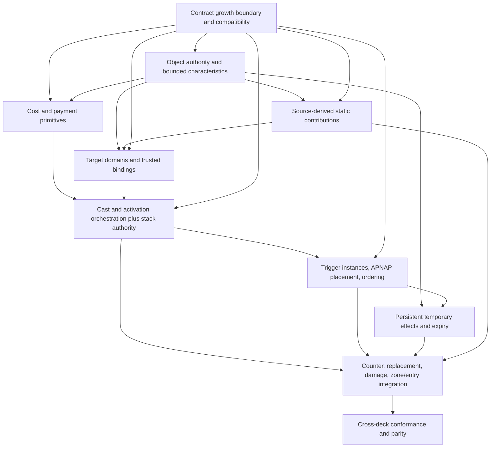

# M4 R1 × W1 Shared Execution Foundation — Semantic Specification

**Task:** `M4_R1_W1_SHARED_EXECUTION_FOUNDATION_SPEC_AND_IMPLEMENTATION_PLAN`
**Status:** PROPOSED / NOT ACCEPTED / NO IMPLEMENTATION AUTHORITY
**Verified master:** `6c6ee4c9b237696c50e944cae998f85c2d358e1c`
**Date:** 2026-09-27
**Production implementation authorized:** NO

## 1. Authority and verified starting point

This proposal is subordinate to the accepted architecture and contracts listed in `AGENTS.md`, #222's exact matchup, the accepted M4.2 Spec and Plan, accepted ADRs, and the pinned Magic authority. It does not override any of them. The fetched `origin/master` was `6c6ee4c9b237696c50e944cae998f85c2d358e1c`, exactly the expected task baseline. PR #248 activation head `a43d151c636544246223c2a3f9a08a72f502e484` is in its history; #225 is closed and its final acceptance records M4.2 complete, `FINAL_ACCEPTANCE_PASS = PASS`, and post-merge `just check-all`, `just release-candidate`, `just archive-check`, diff, hosted CI, and tree identity evidence as PASS. Those are historical exact-head claims, not gates rerun by this task.

Current-status drift was present in README, Roadmap, and the current-status test and is synchronized by this proposal's companion status edit. Historical acceptance records and the accepted M4.2 Spec/Plan retain their acceptance-time phase language. M4.2's three roots—`rules/basic-land-mana@0.1.0`, `rules/land-play@0.1.0`, and `rules/mana-pool@0.1.0`—remain `specified`. This is correct under the capability lifecycle: the bounded Mountain/Plains executable slice passed its acceptance gate; that does not automatically promote the three capabilities to `covered`.

The current registry has 14 entries: the eleven covered Foundation capabilities plus those three specified M4.2 roots. `docs/superpowers/specs/2026-09-26-m4-unified-state-cut-semantic-spec.md` and its plan are accepted historical design inputs, not executable evidence. The current runtime on master uses EngineStatePartsV2, StateDeltaV2, FullStateDigestV6, CheckpointV7, Replay V7, Decision V3, ObservedEvent V3, and PlayerStep V3.

The reviewed R1-exclusive proposal at `e2d0aeb63b679ab1bb500a05a7f56c0244e9626c` is design input only. Its registry baseline correctly records 14 entries and its reviewed corrections to Emberheart's public face-up exile, Warp incarnation/lifetime, Kicker ownership, Shared prerequisites, and automatic permission grants are reflected as R1-exclusive constraints here; they do not establish implementation or support. Cxx identifiers in #237 are research/coordination provenance, never capability identities. No repository-owned locked deck manifest exists; #222 fixes the exact card names and counts and preserves the W1 alias provenance. Do not infer exact printings or card support from that list.

The semantic authority snapshot named by the accepted M4.2 Spec and current audit is Wizards Comprehensive Rules effective 2026-09-25, digest `8d860e451f20f38865b725b42d82feb714c725373dd8f3b32b8652b3eeb070ca`, plus Scryfall Oracle bulk `oracle-cards-20260925210158.jsonl.gz`, digest `c607300fe03ce0d9f59181b1bb33d8001e2fa339b8c68eefd70a6501fa757623`, and Rulings bulk `rulings-20260925210032.jsonl.gz`, digest `375fb0ef1d3338055bb406930b76813b8609256cd7c9592ead940984bf59d520`. Exact source/printing admission remains future work.

## 2. Scope and design rule

The locked scope is the exact 60-card R1 Mono-Red versus exact 60-card W1 Mono-White Auras lists in #222, with its two explicit card-name aliases. This Spec characterizes only reusable execution semantics jointly demanded by those lists, or the common execution owners required to host deck-specific profiles. It does not authorize R1 or W1 card definitions or mechanics.

Apply the #222 growth rule:

```text
selected real cards/interactions
→ semantic requirements
→ recursive capability closure
→ characterize gaps
→ smallest reusable capability
→ RED
→ generic implementation
→ conformance
→ resume content closure
```

An engine layer is Shared only where both locked decks need its generic owner. Haste, Prowess, Warp, Ojer's damage floor/transform, Kicker, R1 turn-history predicates, Trample, Blight, Ward's specific profile, and Dryad Militant's replacement profile remain card/deck-specific semantics. Shared casting, cost/payment, stack, targeting, activation, trigger, effects, characteristics, and replacement orchestration may host those profiles without absorbing their predicates.

Non-goals: universal spell/cost/trigger/replacement/continuous-effect languages; arbitrary Oracle interpreter; callbacks; a generic Magic VM; full CR layer engine; all Standard; Commander/multiplayer; sideboarding/BO3; MCTS; trajectories; optimized rollouts. Every admitted operation must be enumerated and bounded. Unsupported semantics fail closed.

## 3. Shared capability reconciliation

Canonical names below are proposed semantic owner labels only. No version is assigned, no registry row is created, and each item requires a capability-specific accepted spec before implementation. “State substrate” is not semantic support. R1/W1 names are witnesses in #222; Cxx IDs are only linked back to #237 research provenance.

| Research ID(s) / requirement | Current or proposed owner | Classification | R1 witnesses | W1 witnesses | Dependencies | Persistence / decisions / growth | Reason and disposition |
|---|---|---|---|---|---|---|---|
| C01, C02 object attribution/base characteristics | Existing object/content authority; proposed bounded `rules/characteristic-derivation` | `SHARED_FOUNDATION` + `ALREADY_OWNED` substrate | All R1; especially Ojer, Lizard, creature types | All W1; Auras, types, modified predicates | CardDefinition, current face, zone/incarnation, counters, attachments, effect layer order | Derived on demand from one authoritative path; no cache authority. Shared query owner required across legality/effects. Effects may force state growth. | Current ObjectSnapshot/Card IR are data/authority, not a complete live characteristics engine. Enumerate admitted base, face, counters, additive P/T, keywords, type addition, and source-dependent queries only. No universal layers claim. |
| C03, C08, C09 zone/incarnation, entry, tapped | `rules/zone-incarnation@0.1.0` plus entry/tapped behavior review | `ALREADY_OWNED` + bounded `SHARED_FOUNDATION` extension | Creatures, spells, tokens; entry triggers | Creatures, Auras/Roles, exile-return profiles | Object authority, characteristics, event/LKI | Zone changes already persist; no duplicate state. Event and StateDelta extension likely. | Current capability is covered for bounded M3 zone transitions, not all M4 entry/stack routes. Extend its single owner; no new parallel zone engine. |
| C05, C07, C91, C92 setup/shuffle/discard | None proposed in this foundation | `DEFERRED_NOT_REQUIRED` | Ordinary full-game eventually | Ordinary full-game eventually | M4.6 setup | Out of this shared execution slice. | Required for M4 playable-game completion but not needed to specify spell/ability execution; retain as separate downstream closure. |
| C10, C13–C17 timing, turn, cleanup | `rules/turn-structure@0.1.0`, `rules/basic-priority@0.1.0`, `rules/cleanup-reset@0.1.0` | `ALREADY_OWNED` with scope extension | All spells, abilities, combat | All spells, abilities, combat | Trigger/stack/effect expiry ordering | Current turn/priority state persists. New due/expiry data may need state growth. | Existing covered capabilities establish bounded M3 behavior only; do not widen lifecycle from design. Shared execution uses their owner and explicitly adds required priority windows, cleanup and timing. |
| C11, C12 noncombat life/damage and simultaneous result | `rules/damage-and-life@0.1.0` extended; bounded noncombat damage owner/profile to review | `SHARED_FOUNDATION` + `ALREADY_OWNED` | Burn spells, abilities, triggers, Ojer profile | No direct W1 noncombat damage; lifelink/replacement interactions | Characteristics, target revalidation, replacement, life, SBA, history | Core event/application can be atomic/ephemeral; effect resolution payload persists on stack. New authoritative and public event forms may require growth. | Damage/life is a necessary common result owner even though direct card witnesses skew R1. Combat damage additions are reviewed separately. |
| C20, C21, C29, C30 mana pool/production/restriction | M4.2 `rules/mana-pool@0.1.0`, `rules/basic-land-mana@0.1.0`; proposed shared `rules/mana-payment` | `SHARED_FOUNDATION` + `ALREADY_OWNED` substrate | Mountain, Rockface, colored/generic costs | Plains and all spell costs; W1 restrictions/costs | Pool, cost determination, activation/casting | ManaState already persists; payment allocation need not persist except as chosen route/paid status captured on stack. Decision candidate/binding growth likely. | M4.2 expressly excludes spending/payment. Reuse typed pool and mana producers; no duplicate state. Rockface restriction is R1 profile data; generic payment execution is Shared. |
| C22, C27, C33 spell casting, stack authority/resolution | Proposed `rules/spell-casting`, `rules/stack-resolution` | `SHARED_FOUNDATION` | All instants/creatures; Burst kicker | All Auras/creatures/instants/sorceries; card profiles | Costs/payment, target/mode choices, zones, priority, characteristic query | Persist stack object payload, controller, spell/card/face/profile identity, captured modes/targets/cost route/paid flags and resolution data; survive source departure. Contract growth required. | M4.2 has only bounded stack-zone records with controller/source references, not spell payload authority. Must not resolve by looking up a departed live source. |
| C23–C25 cost determination and payment | Proposed `rules/cost-determination`, `rules/mana-payment`, `rules/additional-cost-payment` | `SHARED_FOUNDATION` | Normal costs; Burst additional kicker; Rockface restriction | Ordinary spell costs; Blight may later remain W1 profile | Mana pool, profile cost terms, object/counter/tap/sacrifice operations | Atomic cost commit; stack captures chosen route and whether additional/alternative costs were paid. Payment choice uses authoritative binding; likely Decision contract growth. | Implement only actual mana symbols and selected cost components. Enumerate all sound, complete, canonically ordered allocations; no AutoPay, first allocation, or hidden optimization. |
| C26 timing; C28 activation; C29 mana ability distinction | Proposed `rules/ability-activation` plus existing `AbilityAuthorityState` | `SHARED_FOUNDATION` + `STATE_SUBSTRATE_ONLY` | Fanatical Firebrand, Hired Claw, Rockface, Ojer | Abandoned Air Temple, Evershrike's Gift | Ability identity, timing, payment, target, stack/resolve, zone/face | Activation stack payload persists unless rules-defined mana ability; cost commit atomic. Decision domains extend existing V3 intents. | State ability IDs do not make generic activation work. The source/card profile provides allowed zone/timing/cost/effect; no card-name handler. |
| C31, C32 targeting and target decisions | Proposed `rules/target-legality`, `decision/target-selection` as subordinate domain | `SHARED_FOUNDATION` | Damage spells/abilities, Valiant/Rockface | Auras, protection, Ward interactions | Characteristics, player/object visibility, stack | Declaration targets captured on stack; revalidation occurs at resolution. Trusted IDs bind server-side, public candidates use opaque IDs. Contract growth if current binding union cannot encode complete target group/occurrence. | Candidate generation is all-and-only; reject stale/fabricated response without mutation. Zero legal targets and all-targets-illegal behavior follow bounded CR semantics. |
| C42, C43, C44, C45 trigger event detection/instances/placement/order | Proposed `rules/trigger-detection`, `rules/trigger-stack-placement`; reuse current trigger identity allocator/state only as substrate | `SHARED_FOUNDATION` | Hired Claw, Magebane, Emberheart, Hearthborn, Ojer/Nova ETB/death, Needlehead | Scavenger, Vendor/Role, Bat, Ward, Saga triggers | Semantic event stream, stack payload, target/cost/payment, APNAP, priority | Pending triggers and stack-bound source/event snapshot survive boundaries. Current TriggerRecord stores ID/controller only, insufficient. New typed state and event/delta/digest/checkpoint/replay growth likely. | Trigger predicates/effect profiles remain specific. Place all simultaneously triggered instances via APNAP and explicit same-controller order; never container order. Reflexive/delayed triggers are deferred unless complete R1×W1 clause proof requires them. |
| C34 counter/counter-spell | Proposed `rules/stack-counter` as part of stack resolution owner | **RECLASSIFIED_TO_SHARED_REQUIRED** | R1 spells are valid targets of W1 Ward-generated counter ability | Sheltered by Ghosts, Skyward Spider Ward | Trigger and stack payload, target spell identity, counterability, destination replacement | Counter operation is an atomic stack transition; its spell destination is subject to shared replacement pipeline. Captured target StackObjectId must survive. | #237 called this W1-only. Ward's wording counters the spell or ability that targeted a ward permanent unless its controller pays. Either R1 or W1 may control that targeted spell/ability in the locked matchup; generic counter authority is therefore necessarily Shared. Ward profile remains W1-only. |
| C35–C39, C41 characteristics and effects | Proposed `rules/characteristic-derivation`; separate `rules/temporary-effect-record` for duration-bound changes | `SHARED_FOUNDATION` for common derivation/temporary owner; the type-addition and Aura/Role profiles remain W1-owned | Prowess/Rockface temporary operations; Haste remains R1-only | Aura/Role live contributions, temporary grants | Characteristics, attachment state, turn/cleanup, event source/LKI | Temporary instances persist through digest/checkpoint/fork/replay/delta; current label-only EffectRecord is insufficient. Live Aura/Role contributions are derived from source/profile/attachment and have no temporary-effect record. Contract growth required for temporary records. | Admit only additive P/T, keyword/type operations and selected conditions after profile closure. Keep source-derived and duration-bound operations as distinct semantic inputs. |
| C40 counters | Proposed `rules/counter-operations`; reuse M4.2 CounterState | `SHARED_FOUNDATION` + `STATE_SUBSTRATE_ONLY` | Hired Claw +1/+1 | Scavenger +1/+1, Blight -1/-1 | Characteristic derivation, zone incarnation, SBA, events | Counts already persist; operation semantics/event delta still missing. Event union extension review required. | CounterState existence is not counter support. Exact admitted counter kinds are +1/+1 and -1/-1 initially; lore only if a selected W1 card in locked list needs it (Saga is Origin of Spider-Man? characterize source identity before admission). |
| C48 LKI / event snapshots | Existing ObjectSnapshot and zone-incarnation event owner; extend through stack/trigger capture | `ALREADY_OWNED` + `SHARED_FOUNDATION` | Source leaves before ability/trigger resolves; Ojer profile | Ward/trigger source or enchanted object departs | Zone events, source-independent payload | Snapshot captured when rule event requires it; no duplicate global LKI state. Stack/trigger payload carries only relevant typed snapshot. | Existing snapshots are partial substrate and may be insufficient for all clauses. Keep LKI local to captured rules meaning; don't persist a generic event log as semantic state. |
| C53–C57 combat and keyword extensions | Existing covered combat owners plus bounded proposed `rules/combat-damage-extensions` | `SHARED_FOUNDATION` only for common engines | First strike, flying, haste/trample profile interactions | Flying, first strike/strike, lifelink, reach, vigilance | Characteristics, attacker/blocker legality, damage assignment, damage result | Existing combat state reused; additional assignment/step facts may require state/event/decision contract growth. | Haste/trample are R1 profiles; flying/reach/lifelink/vigilance/first strike are W1 profiles. Shared combat extension owns only reusable rules and decisions where actual closure demonstrates both-side need (including effects/interactions), not the keywords as one giant capability. Re-characterize whether first strike is truly shared before allocation. |
| C59 replacement orchestration; C60/C61 specific replacement | Proposed `rules/replacement-application`; Ojer and Dryad profiles remain exclusive | `SHARED_FOUNDATION` | Ojer noncombat damage replacement; R1 spell destination can be replaced | Dryad Militant graveyard replacement; Ward-related counter destination | Damage/zone event, characteristics, source/LKI, destination | Eligible replacements are derived from live state/profile at event time; apply within one atomic event. No persistent ReplacementState established. Temporary bookkeeping ephemeral; records only needed if a choice spans a boundary. | C61 is Shared because the replacement pipeline may process R1 instant/sorcery card destinations too. Dryad predicate is W1-only. Handle replacement ordering, chooser, repeat prevention and history only as required. |
| C61 Dryad Militant profile | `mechanic/instant-sorcery-graveyard-exile` (profile, not orchestration owner) | `W1_EXCLUSIVE` profile; its generic replacement applicability is Shared | R1 instants/sorceries are affected objects | Dryad Militant | Shared replacement application, characteristics, zone transition | No record for static source-derived effect; ordinary transition/zone event persists. | Keep card-specific qualifying condition in W1. Shared pipeline applies it to any qualifying card, including R1. |
| C34 Ward | `mechanic/ward` (profile); Shared stack-counter/trigger/payment owners | `W1_EXCLUSIVE` profile; counter owner Shared | R1 spell/ability can be countered | Sheltered by Ghosts, Skyward Spider | Target events, triggers, stack-counter, payment | Ward trigger captures targeted stack object/controller; explicit pay/decline decision. Existing Choice domains may express boolean but payment route requires capability contract review. | Keep Ward keyword and `{2}` profile W1-only. Generic trigger/counter/payment owner Shared. |
| C47, C49–C52 R1 histories; C50 W1 graveyard history | Existing `TurnHistoryState` | `R1_EXCLUSIVE` consumers / `W1_EXCLUSIVE` consumer + `ALREADY_OWNED` substrate | Spell counts, life-loss, red damage, target/use history | Permanent card graveyard predicate | Spell/damage/target/zone event producers | Relevant ledger fields already persist; no duplicate ledger. Producers and reset must be events/transition operations. | Shared foundation must emit trustworthy events that the two deck-specific consumers need, but the predicates remain deck-exclusive. |
| C46 delayed effects, C62 linked exile, C63 permissions, C64–C65 transform/return, C66–C76 Aura/token/Role/Saga/graveyard and modified profiles | Future exact owner review | `R1_EXCLUSIVE`, `W1_EXCLUSIVE`, `STATE_SUBSTRATE_ONLY`, or `NEEDS_FURTHER_CHARACTERIZATION` by row | Warp/Ojer/Valiant permissions; R1 faces | Auras/Role/tokens/Saga/linked return/graveyard activation | Shared owners above | State additions only after persistence proof. | Do not pull profile semantics into shared layer. Scope and recursive dependencies require separate content-specific review after foundation. |

### Explicit C34 and C61 decisions

Wizards' rules definition of Ward is a triggered ability that counters “that spell or ability” unless its controller pays its ward cost (CR 702.21a). A qualifying targeted spell can be from either deck in this matchup. C34's generic counter operation is Shared; Ward remains W1-specific. Dryad Militant's text replaces an instant or sorcery card going to a graveyard from anywhere with exile. R1 contains instant and sorcery cards, so the shared replacement application path must accept their destinations; Dryad's type predicate and static profile remain W1-specific. The #237 inventory's original W1-only labels for C34/C61 are therefore corrected at the semantic-owner level, not by moving their card profiles into Shared.

## 4. Persistent authority and contract growth

Persist only values whose future legal actions, outcomes, or replay equivalence depend on them after the current atomic transition. Every persistent record must be typed, canonically ordered, validated, digest-bound, checkpointable, fork-equivalent, replay-reproducible, and projected through the information boundary.

| Semantic value | Current representability | Must persist? / derivable? | Departure behavior | Contracts / privacy / action |
|---|---|---|---|---|
| Spell stack payload: card/face/profile, controller, captured modes/targets, cost route, paid flags, resolution data | No. `StackRecord` has controller/source/source ability only. | Yes until resolution/counter; not derivable safely from current source after it leaves. | Spell identity and cast facts are captured; source departure does not erase stack object. | EngineStatePartsV2, StateDeltaV2, FullStateDigestV6, CheckpointV7, Replay V7 and stack validation need review/growth. Targets are trusted IDs internally; observations use opaque IDs only. |
| Ability stack payload: ability key/profile, controller, source/LKI, targets, paid costs/effect snapshot | No. Ability authority and stack record do not contain effect payload. | Yes for non-mana abilities until resolution; ability ability text/source may depart. | Capture source snapshot needed by resolution. | Same persistence family as stack payload; no callbacks or live-source lookup as authority. |
| Trigger instance: controller, source/event snapshot, profile/effect, target timing and intervening-if facts | No. `TriggerRecord` contains only ID/controller. | Pending instance persists until placed/resolved. Event/source facts may not be derivable later. | Source departure does not remove an already-triggered instance; LKI as required. | ExecutionState/stack record and event/delta/digest/checkpoint/replay growth. Trigger identities remain trusted. |
| Choices / cost paid status / targets / modes | Only coarse V3 visible intents and existing closed scalar answer domains. | Yes when relevant to future resolution; captured in stack payload. | Independent of source departure after cast/activation. | Decision V3 intent/binding/domain and PlayerStep V3 require review; likely closed union growth for cost allocation and grouped targets. No trusted IDs in player payload. |
| Generic temporary effect + duration/expiry/source dependence/timestamp | Not representable by `EffectRecord { id, label }` as semantic authority. | Yes across decisions through expiry. Intrinsic/static effects can be derived from current face/profile; granted/one-shot effects cannot. | Source-dependent and source-independent durations each follow explicit admitted profile rules. | State/delta/digest/checkpoint/replay and possibly observation/event schemas. Publicly reveal only rule-public effects. |
| Permission/delayed effect records | No admitted generic typed record in M4.2 closure. | R1-specific permission and Warp may require persistence; omitted from this Shared foundation unless cross-matchup witness changes. | Must survive source departure if effect says so. | Deferred R1 profiles; do not reserve a speculative shared state family. |
| Replacement registry/bookkeeping | No generic record. | No for currently identified static/live replacements; derive eligible effects and process inside event transaction. | Source's live presence/profile governs eligibility; capture LKI only where CR says replacement already applies to event. | Keep orchestration ephemeral. Persist only if a future locked effect creates a cross-transition obligation, with new review. |
| Mana allocation | ManaState records pool units/restrictions, not pending pay allocation. | Allocation is one explicit decision and commits atomically; no need to persist after costs paid. Paid-route result persists on stack. | No source dependency after payment. | Decision/binding growth; StateDelta operations; no extra mana ledger. |
| Counters, attachments, faces, current-turn history, ability registry | Already represented in M4.2 state. | Existing fields persist and are digest/checkpoint/replay inputs. | Existing incarnation rules apply. | Reuse accepted state; no duplicate families. Does not confer operation support. |

### Contract-growth determination

`CONTRACT_GROWTH_REQUIRED` for Shared implementation. The next version names are deliberately not selected. Exact compatibility review is needed for:

| Contract family | Why current closed meaning is insufficient | Required review |
|---|---|---|
| EngineStatePartsV2 / execution state / stack records | No typed spell/ability payload, captured cast choices, rich trigger payload, or semantic temporary effect. | Decide whether accepted state cut can be coherently extended or a separately versioned identity cut is required; preserve current bytes and one current writer. |
| StateDeltaV2 and authoritative event/operation vocabulary | New stack/effect/counter/payment/target/cast/trigger transitions need exact ordered audit operations and compositional state equality. | Define event-before/event-after cursor and atomic reject invariants; no event-only state. |
| FullStateDigestV6, CheckpointV7, Replay V7 | Persisted semantic input/payload shapes change. Current identities cannot silently absorb new fields. | Independent compatibility/version identity decision before implementation; every persisted value in digest/checkpoint/fork/replay. |
| Decision V3 / PlayerDecisionRequestV3 / PlayerStepV3 and schemas/goldens | New payment routes, target groups, trigger order, and replacement/payment choices need typed complete domains and trusted bindings. V3 intents alone do not encode every cost allocation. | Determine whether current hierarchical ChooseOne/Many/Order/Number can represent a given choice with existing bindings; add only necessary closed intent/binding/data shapes. No new top-level variant unless unavoidable. |
| Authoritative event and ObservedEvent V3 / observation / PlayerInformationStateV2 | Public spell/zone/counter/effect facts and private choice data need safe projection; current closed event unions may not express them. | Identify public vs private event, visible opaque identities, sequence/knowledge invalidation and paired-state noninterference. Do not expose StackObjectId or trusted payload. |
| Card semantic/profile vocabulary | Cost, target, trigger, effect and replacement profiles need typed admitted operations. | Extend only source-of-truth catalog under normal generator; no universal script or arbitrary payload. |

No family's next version is predeclared. A separate contract-growth Spec and independent acceptance are prerequisites when existing closed identity meaning cannot safely carry the required semantics.

## 5. Execution semantics

### 5.1 Shared stack and resolution

Use a bounded typed stack object for spells and non-mana abilities. The record owns controller, immutable profile/content identity, spell card/face or ability identity, source incarnation snapshot when required, declared targets and modes, paid additional/alternative cost facts, and resolution payload. It contains no card name dispatch, arbitrary text, callback, closure, or interpreter label. Stack order remains an explicit authoritative sequence. Resolution reads the captured payload; it never reconstructs cast choices by querying the live source. Mana abilities that satisfy the rules definition resolve immediately and do not create stack objects.

Countering removes the exact StackObjectId atomically and applies its rules-defined destination through the replacement pipeline. A countered stack item cannot resolve. Destination, card type, ownership, source departure, and applicable replacement are validated together.

### 5.2 Casting and cost/payment

S2 implements reusable cost and payment primitives, not a claim that the final total cost is determined before targets. The bounded cast is an explicit staged action under priority: select the spell and applicable route; choose modes and targets at the rules-specified point; determine the resulting total cost; construct the complete legal payment domain; explicitly choose a payment allocation when more than one exists; atomically pay and create the typed stack payload; emit cast evidence and update history; then continue priority/trigger processing. Exact ordering comes from the pinned CR (including CR 601) and the admitted profile. The target-domain owner in S3 must therefore be accepted before S4 can complete a targeted cast or activation.

Ordinary colored, generic, and where needed colorless mana costs are in scope. Generic mana is a cost symbol, not a pool type. Existing typed restriction buckets are reused; restriction predicates are provided by profile, not arbitrary strings. Additional tap/sacrifice/counter costs are admitted only for specifically characterized clauses. Every accepted cost is all-or-nothing with state/event/delta/trigger evidence. No AutoPay, cheapest/first allocation, RNG, or hidden policy. The legal payment relation must be independently proven sound, complete, deterministic, bounded against overflow, and sorted by a semantic comparator before dense request-local IDs.

Every player-controlled cost route and allocation remains an explicit agent step. Payment candidates bind trusted mana units and sources internally; only safe public semantic intent is projected. An invalid, stale, incomplete, fabricated, or out-of-domain answer rejects with total nonmutation.

### 5.3 Targets and activated abilities

Target-domain construction and declaration legality use the single characteristic/visibility path and precede cast/activation commit. At declaration, candidate objects are player-opaque IDs, players may use public player IDs, and trusted bindings retain GameObjectId incarnation. The selected target binding is then captured in the stack payload created by casting/activation. At resolution, revalidate each target under current rules and bounded profile. Apply all-target-illegal and partial target behavior from the pinned rules. Copies/retargeting are deferred unless a locked clause and closure prove them necessary; no assumptions about a generic copy system.

Generic non-mana activation checks source zone/face/profile authority, timing, once-use hook supplied by the profile, full cost, target/mode choices, and activation commit. It creates a stack object unless the ability qualifies as a mana ability under the admitted rule. Activation is not a card-specific executor. Specific once-per-turn predicates, Haste, Warp, and card text remain profile-owned.

### 5.4 Triggers and ordering

For each atomic semantic event, detect only the admitted trigger patterns from the before/after facts and event snapshot. Create a typed trigger instance with controller, source/profile identity, captured event/LKI values needed to evaluate resolution, and any trigger-time target/cost facts. Do not later infer these facts from a departed source.

Place simultaneous triggers according to APNAP. The appropriate player explicitly orders multiple triggers they control; offer a complete canonical order domain. Target choice occurs at the rules-specified point. A trigger already created persists despite source departure. Collection iteration is never ordering authority. Intervening-if and reflexive triggers are included only when their selected R1/W1 card clause requires them and then get explicit profile rules; delayed triggers are not admitted as a generic subsystem by this foundation.

### 5.5 Temporary effects, source-derived contributions, and characteristics

The shared characteristic derivation path is the common query owner; it does not make every source of characteristic changes one state family. It evaluates base/face data, counters, typed temporary records, and bounded contributions derived from currently present source profiles/attachments through separately owned inputs. Every legality, damage, target, combat, cost, trigger predicate and replacement query consumes this one path.

Temporary effects (for example, Prowess or a selected until-end-of-turn grant) are mutable effects whose operation must survive a transition after its creating event. Their typed records carry affected incarnation(s), operation data, timestamp/order where required, and duration/expiry/source dependency. The initial duration candidate is until end of turn; other expiry semantics require a named witness and separate characterization. They require persistent authoritative state and the associated contract growth.

Static Aura/Role contributions are derived from a currently existing source profile and live attachment relation each time characteristics are queried. The source and AttachmentState already persist; no until-end-of-turn-style effect record or shared temporary-effect lifetime owner is introduced for them. Aura/Role operation profiles remain W1-owned. If a source leaves or an attachment ceases, the derived contribution ceases according to the profile/rules; any resulting SBA or event is handled by its own owner.

Do not claim all CR layers, dependency timestamps, copy effects, or arbitrary effects. Ambiguous ordering blocks the affected operation. Temporary records and source-derived contributions may share the characteristic derivation consumer, but they have separate semantic and persistence ownership.

### 5.6 Replacement, damage and zones

At an event boundary, compute eligible replacements from current authoritative state and typed profiles. Apply required replacement choices explicitly where multiple legal effects require a player choice; preserve the event-before/event-after relation, repeat prevention, source/LKI semantics and deterministic ordering. Then emit actual final event/history and zone state. Replacement iteration is transaction-local for known static/live effects; no `ReplacementState` or generic history map is proposed.

The Shared pipeline is not itself Ojer's damage floor or Dryad Militant's qualifying-card rule. It provides the common event replacement owner. Damage handling is extended for noncombat spell/ability effects and appropriate life/damage consequences; prevention, deathtouch, infect, arbitrary redirection and other un-witnessed families remain out of scope. Existing combat damage/life capability stays its owner; first-strike/lifelink/other keyword extensions require their own closure proof.

### 5.7 State and entry events

Reuse M4.2 `ManaState`, `TurnHistoryState`, `CounterState`, `AttachmentState`, `FaceState`, `AbilityAuthorityState`, current identity allocators, zones and ObjectSnapshot. Counter mutations, object entry, stack transitions and LKI are rule operations/events, not new duplicate state owners. Existing `zone-incarnation` remains the owner of incarnation transitions; inspect/extend its contract for stack and replacement routes. None of these state families upgrades lifecycle by implication.

## 6. Decision, information and product consistency

The outer DecisionResponseV2 remains one explicit choice response per agent step. Existing closed ChooseOne/ChooseMany/ChooseNumber/Order domains and current V3 visible intents may represent some individual steps. The candidate must be exact, complete, canonically ordered, request-local, and bound to its trusted semantic value. Spell/action, target, mode, payment, optional cost/ward payment, trigger order, replacement choice and combat assignment are separate logical actions when the player makes separate meaningful choices. A hierarchical continuation may connect them but cannot hide a choice in one aggregate auto-policy.

Review whether a new top-level Decision variant is necessary only after trying existing domains. Add only required closed Decision V3/schema/PlayerStep fields, and do not expose trusted object/stack/ability IDs, physical-card IDs, hidden definitions, raw FaceKey, seed, RNG cursor, checkpoints, continuations, or capability metadata. Hidden library/look/scry identity stays owner-scoped. Normal face-up exile is public even when a card originated in a hidden zone. Add paired-state tests for each new private path.

Each accepted transition yields mutually consistent authoritative state, ordered semantic operations/events, StateDelta replacement, public ObservedEvent projection, next Decision and status. No state-only semantic mutation or event-only authority. Rejected transitions preserve all state, allocators, requests, information bytes and accepted replay history. Projection failure aborts before commit.

All persistent shared values participate in canonical digesting, checkpoints, restore, fork, replay re-execution and all applicable deltas. Direct = restored = forked = replayed semantic products for the same identity and responses. No hash-map order, pointer identity, allocation incidental order, wall time, or callback behavior affects meaning. Historical bytes remain exact.

## 7. RED, conformance and gates

Before implementation, each proposed capability gets independent characterization cases citing the pinned CR/Oracle/rulings authority. RED must cover at least:

* complete spell/activation/cost/payment domains, colored/generic/restricted allocations, extra/alternative cost routes, overflow and rejected atomicity;
* target legality at declaration and resolution, stale incarnation, all illegal/partial legal sets, visibility and candidate completeness;
* captured stack payload and resolution after source departure; countered vs resolved destination under replacements;
* trigger detection at exact event point, source departure/LKI, trigger controller, APNAP ordering and all same-controller order candidates;
* temporary effect operation boundaries, ordering, characteristic query parity, source departure, expiry and cleanup;
* replacement eligibility/order/chooser/repeat prevention and actual event/history after replacement;
* every new authoritative field through StateDelta, digest, checkpoint, fork and replay;
* paired hidden worlds with equal player information: byte-identical allowed observations/candidates/events and no trusted ID disclosure;
* direct/restore/fork/replay parity and historical golden preservation.

Candidate soundness/completeness requires an independent bounded oracle; Rust remains the only production rules authority. Add property/fuzz tests for canonical arrays, arithmetic boundaries, event sequences and rejected responses. Run cross-card R1×W1 interactions before any coverage promotion. Test presence or compilation is not certification.

## 8. Entry/exit gates and relationship to M4

Future Shared implementation entry requires all of:

```text
POST_M4_2_STATUS_SYNC = PASS
#237_RECONCILIATION = REVIEWED
SHARED_SPEC_REVIEW = PASS
SHARED_PLAN_REVIEW = PASS
CONTRACT_GROWTH_BOUNDARY = ACCEPTED
EXACT_IMPLEMENTATION_BASELINE = FROZEN
```

Only then may `SHARED_IMPLEMENTATION_AUTHORIZED = YES`. This proposal itself does not satisfy independent review or accept contract growth.

Exit means only the exact accepted shared foundation has reusable semantics, complete decisions, atomicity/nonmutation, state/event/delta consistency, information safety, checkpoint/fork/replay parity, schema/wire parity, historical compatibility, capability evidence, exact-head CI and independent/post-merge review. It unblocks dependent R1/W1 work only. It does not mean M4, M4.3, M4.4, playability, bundle certification, or all Standard is complete.

M4.3 and M4.4 remain not started in production. Their exclusive semantic profiles stay with those workstreams. #222 remains the M4 target/closure authority; #237 remains an open coordination issue whose stale assumptions must be reviewed and corrected before workstream claims or implementation. The companion plan is subordinate to this proposal. Any discovered semantic change requires stopping, amending this Spec, independent re-review, and regenerating the Plan.

## 9. Reconciliation result summary

* Shared execution owners are spell cast/stack/resolution, cost and payment, targets, non-mana activation, trigger creation/placement, bounded effects and characteristic derivation, counter operations, replacement application, and extensions to existing zone/damage/combat owners where the exact closure justifies them.
* Reuse current rules owners and M4.2 state; do not create duplicate state or promote capabilities because state exists.
* C34 counter authority and C61 replacement application move from #237's W1-only buckets to Shared requirement because the generic effects cross deck boundaries. Ward and Dryad profiles stay W1-exclusive.
* No canonical new capability version or contract version is allocated. Contract growth is required before implementation for closed stack/effect/event/decision surfaces.

## 10. Dependency DAG and node obligations



| Node / semantic owner | Dependencies and why Shared | Direct R1 / W1 witnesses | Persistent state? | New Decision? | Contract growth? | Unblocks |
|---|---|---|---|---|---|---|
| G0 — accepted cross-layer contract-growth decision (architecture/persistence/decision owners; not a capability) | Prerequisite because current closed successor meanings lack payloads/bindings; one coordinated cut prevents duplicated migrations. | All stack/cost/trigger/effect clauses / same | Defines whether stack, trigger, effect, candidate and event records persist. | Defines only required closed choices. | **Yes, before any producer.** | Every semantic node below. |
| S1 — `rules/characteristic-derivation` (proposed) | One query path for base/face/counter values and admitted source-derived contributions, used by both decks' legality and outcomes. Depends on G0; reuses M4.2 state and content facts. | Ojer/Lizard, Prowess/Rockface / Aura, Role, modified, Ward, keywords | Queries and live-source contributions are derived. Persistent temporary records are S6a, not S1. | No direct decision. | Review if S6a adds characteristic fields; not a second authority. | Cost eligibility, S2b static contributions, S3 target legality, effects/replacements/combat. |
| S2 — `rules/cost-determination` + `rules/mana-payment` primitives (proposed) | Shared payment owner; depends on S1 and existing ManaState/mana-pool. This batch supplies cost/payment operations; it does not claim a complete cast sequence. | Spells, kicker, restricted Rockface costs / all spell/Aura costs, Ward payment | Payment allocation ephemeral and atomic; paid route is later captured in stack payload. | Yes, explicit payment/additional-cost choices. | **Yes** for cost allocation candidate/binding if V3 cannot express it. | S4 cast/activation orchestration. |
| S2b — bounded source-derived static contribution evaluation within `rules/characteristic-derivation` | Evaluate current source/profile/attachment contributions before target-domain construction. This is a distinct derivation input, not temporary expiry. | Current-face/intrinsic queries where applicable / Aura and Role attachments | No generic effect record; derive from live source/profile/attachment on query. AttachmentState persists the relation. | No direct decision. | Review event/observation only if characteristic changes need public evidence; no effect-state family. | S3 target legality and later S6b interactions. |
| S3 — `rules/target-domain` + `decision/target-selection` (proposed) | Shared because both decks target; depends on S1/S2b characteristics and G0's trusted binding/projection decision. It precedes cast/activation commit. | Damage/ability targets / Auras and Ward interactions | Chosen targets are captured by S4 in stack payload, not persisted separately here. | Yes, explicit complete domains and trusted bindings. | **Yes** if grouped target/binding data exceeds current V3 shapes. | S4 cast/activation orchestration; S5 target-trigger detection. |
| S4 — `rules/spell-casting`, `rules/ability-activation`, `rules/stack-resolution` (proposed) | Both decks need one complete action/stack owner. Depends on S2 cost/payment, S3 target domains, priority, zones, and S1/S2b characteristics. | All R1 spells and abilities / all W1 spells, Auras and abilities | **Yes:** typed spell/ability payload, chosen targets/modes/routes, paid-cost facts, source/LKI and resolution data until stack item ends. | Yes for spell/ability, route, modes, targets and payment as distinct logical steps. | **Yes:** state/delta/event/digest/checkpoint/replay and likely decision/schema growth. | S5 triggers; S6b counter/replacement/damage. |
| S5 — `rules/trigger-detection` + `rules/trigger-stack-placement` (proposed) | Shared event-to-instance owner and APNAP ordering. Depends on typed S4 events/payload, target/cost owners, and G0. | Cast/attack/damage/entry/death triggers / Ward, Aura/Role/Saga and creature triggers | **Yes:** pending trigger and captured event/source snapshot across boundaries. | Yes: trigger order, target and optional payment/choice where applicable. | **Yes:** trigger execution/state/event/delta and projection contracts. | S6a trigger-created temporary effects; S6b trigger damage/counter/replacement. |
| S6a — `rules/temporary-effect-record` + `rules/effect-expiry` (proposed) | Persistent temporary modifications share a bounded record/lifetime owner and consume S1 derivation. They are not source-derived Aura/Role contributions. | Prowess/Rockface temporary changes (Haste profile remains R1-specific) / only witnessed temporary W1 grants | **Yes:** typed temporary effect and expiry/source-dependence survive transitions. | Effect creation is usually forced; meaningful profile choices stay explicit. | **Yes:** typed state, delta, digest, checkpoint, replay and relevant event/projection review. | S6b interactions and dependent duration-bound profiles. |
| S6b — `rules/replacement-application` + damage/counter/zone owner extensions | Shared event pipeline because R1 damage/spells can meet W1 replacement/counter effects, and vice versa. Depends on S2b/S4/S5/S6a and existing damage/zone owners. | Damage spells and stack items affected by W1 profiles / Ward counters R1 stack, Dryad affects R1 instants/sorceries | Replacement bookkeeping ephemeral for known static/live profiles; outcomes persist in existing zone/counter/damage/history state. | Only if multiple applicable legal replacements require an actual choice. | Event/delta and Decision growth only as found at G0. | All accepted spell/trigger/effect interaction closure. |
| S7 — shared conformance/evidence (not a capability) | Proves the nodes and products compose for both decks; no semantic owner is moved here. Depends on all prior nodes. | All admitted R1 interactions / all admitted W1 interactions | No new state. | Proves every new domain complete/sound. | Runs all accepted parity and historical compatibility proofs. | Allows dependent M4.3/M4.4 profile work to resume; does not finish either deck. |

## 11. Complete #237 research-ID disposition

This table closes the coordination labels as provenance. “Foundation” means a likely owner required by this Shared execution slice; “later Shared” means common but outside this initial implementation cut; `ALREADY_OWNED` means reuse/extend the canonical current owner without inferring broader support. Each row's card witnesses and stated dependencies remain those in #222/#237 and the accepted M4.2 audit; row groupings do not create canonical keys.

| Research ID(s) | Re-derived disposition | Reason / boundary |
|---|---|---|
| C01 | `ALREADY_OWNED` + shared query requirement | Object owner/controller facts are core state authority, not a new capability. |
| C02 | `SHARED_FOUNDATION` | One bounded characteristic derivation path is needed for both decks' legality and effects. |
| C03 | `ALREADY_OWNED` + shared extension | Reuse/extend `rules/zone-incarnation@0.1.0`; current covered scope does not imply all M4 zone routes. |
| C04 | `W1_EXCLUSIVE` / later | W1 library ordering/scry profile only; common ordered-zone representation is state substrate. |
| C05 | `DEFERRED_NOT_REQUIRED` for this foundation | Shuffle is game initialization (M4.6), not spell/stack foundation. |
| C06 | `ALREADY_OWNED` + shared extension | Reuse `rules/draw-card@0.1.0`; selected draw-trigger consumers need common event evidence. |
| C07 | `DEFERRED_NOT_REQUIRED` | No selected shared execution requirement established for general discard. |
| C08–C09 | `SHARED_FOUNDATION` / existing state reuse | Entry and tapped state are required by both, but state facts alone are not execution support. |
| C10 | `ALREADY_OWNED` substrate + shared query | Existing turn/control facts inform current combat; do not invent a separate control-duration capability. |
| C11 | `ALREADY_OWNED` + shared extension | Reuse bounded `rules/damage-and-life@0.1.0` owner; widen only where spell/ability outcomes need it. |
| C12 | `SHARED_FOUNDATION` + same existing owner | Add bounded noncombat damage processing under the same authoritative damage path. |
| C13–C17 | `ALREADY_OWNED` + shared extension | Reuse turn-structure/priority/cleanup owners; M3 coverage remains bounded. |
| C18 | `DEFERRED_NOT_REQUIRED` for this foundation | Terminal outcome closure belongs to complete playable-game work (M4.6), not the shared spell substrate. |
| C19 | `ALREADY_OWNED` + shared extension | Reuse combat-SBA owner and separately characterize other reachable selected SBA families. |
| C20–C21 | `ALREADY_OWNED` | Reuse M4.2 land-play and mana-pool roots; both remain lifecycle `specified`, not support claims. |
| C22–C29 | `SHARED_FOUNDATION` | Stack, payment, costs, casting, timing, activation, and mana-ability distinction form common owners. C30's restriction predicate is R1-specific profile data. |
| C30 | `R1_EXCLUSIVE` profile on Shared payment | Rockface restricted mana is R1-specific; generic payment/allocation engine is Shared. |
| C31–C33 | `SHARED_FOUNDATION` | Target legality/selection and resolution consume both decks' shared stack and characteristic owners. |
| C34 | `RECLASSIFIED_TO_SHARED_REQUIRED` | Generic countering can target an R1 spell/ability through W1 Ward. Ward itself remains W1-exclusive. |
| C35–C38 | `SHARED_FOUNDATION` | Bounded derivation/lifetime/P-T/ability-grant mechanics host both decks; specific Haste/Prowess/Aura profiles stay exclusive. |
| C39 | `W1_EXCLUSIVE` operation profile on Shared derivation | Type addition is used by the W1 profile; generic characteristics query remains shared. |
| C40–C41 | `SHARED_FOUNDATION` + state substrate reuse | Counter operations and P/T interpretation connect both decks; M4.2 CounterState is not an executor. |
| C42–C44 | `SHARED_FOUNDATION` | Common trigger event-to-instance, stack placement and explicit ordering owners; trigger predicates/effects remain profile-owned. |
| C45 | `W1_EXCLUSIVE` / defer until needed | Reflexive-trigger pattern is a W1 profile; no generic reflexive language is authorized. |
| C46 | `R1_EXCLUSIVE` / defer | Nova Hellkite Warp delayed scheduling is R1-specific and is outside the common first foundation. |
| C47, C49, C51–C52 | `R1_EXCLUSIVE` consumers + existing TurnHistoryState | Spell counts, life/red damage predicate, once-use and first-target history are R1-specific; common event producers must supply facts. |
| C48 | `SHARED_FOUNDATION` / existing snapshot reuse | Shared stack/trigger resolution needs bounded LKI; reuse event/ObjectSnapshot owners and capture only required facts. |
| C50 | `W1_EXCLUSIVE` consumer + existing TurnHistoryState | Permanent-card-to-graveyard history is W1-specific predicate, not a new shared ledger. |
| C53–C57 | `ALREADY_OWNED` + shared bounded combat extension | Reuse covered attacker/blocker/combat damage owners; extend only for exact selected combat rules/keywords. |
| C58 | Proposed `decision/combat-damage-assignment` | `SHARED_FOUNDATION` candidate, `NEEDS_FURTHER_CHARACTERIZATION` | Complete player-controlled combat-damage-assignment domain and trusted bindings are a decision owner distinct from damage/life application. Characterize exact R1/W1 witnesses, completeness, ordering, and contract impact before batch acceptance. |
| C59 | `SHARED_FOUNDATION` | Replacement application is the common event pipeline; not an extensible DSL. |
| C60 | `R1_EXCLUSIVE` | Ojer damage-floor predicate/profile only. |
| C61 | `RECLASSIFIED_TO_SHARED_REQUIRED` application; W1-only predicate | Dryad applies to R1 instant/sorcery destination events too; its replacement condition remains W1-specific. |
| C62 | `W1_EXCLUSIVE` / defer | Linked exile/return is a W1 Aura profile; no generic link state without proof. |
| C63–C65 | `R1_EXCLUSIVE` / defer | Valiant/Warp play permission, Ojer transform and return profile. |
| C66–C76 | `W1_EXCLUSIVE` profiles or `NEEDS_FURTHER_CHARACTERIZATION` | Aura/attachment, token, Role, scry/look, Saga, Blight, graveyard ability and modified predicates. Reuse Shared cast/target/activation/trigger/effect/state owners; do not move their profile semantics into Shared. |
| C77 | `LATER_SHARED` | Legend-rule SBA has R1 Ojer and W1 Origin witnesses but is outside the first stack/cost cut. |
| C78 | `R1_EXCLUSIVE` | Haste profile. |
| C79 | `SHARED_FOUNDATION` bounded combat/characteristic operation | Flying has direct R1 and W1 witnesses; implement only the blocking restriction required by admitted combat. |
| C80 | `W1_EXCLUSIVE` | Reach profile. |
| C81 | `SHARED_FOUNDATION` bounded combat extension | First strike has direct R1 Needlehead and W1 Ethereal Armor witnesses. |
| C82, C84–C87 | `W1_EXCLUSIVE` profiles | Double strike, vigilance, lifelink, hexproof and Ward are W1-specific; their generic combat/damage/target/trigger/counter/payment owners are shared where applicable. |
| C83, C88–C90 | `R1_EXCLUSIVE` profiles | Trample, Prowess, Kicker and Warp remain R1-specific. |
| C91–C92 | `DEFERRED_NOT_REQUIRED` for this foundation | Initialization and London mulligan are common game-start requirements but belong to M4.6 setup closure, not Shared execution foundation. |

The classification separates common engines from the deck-specific operations that call them. Where this proposal says later/deferred, it does not waive M4 completion: those requirements must return through the applicable Shared/R1/W1 closure before the locked matchup can be called playable or certified.
